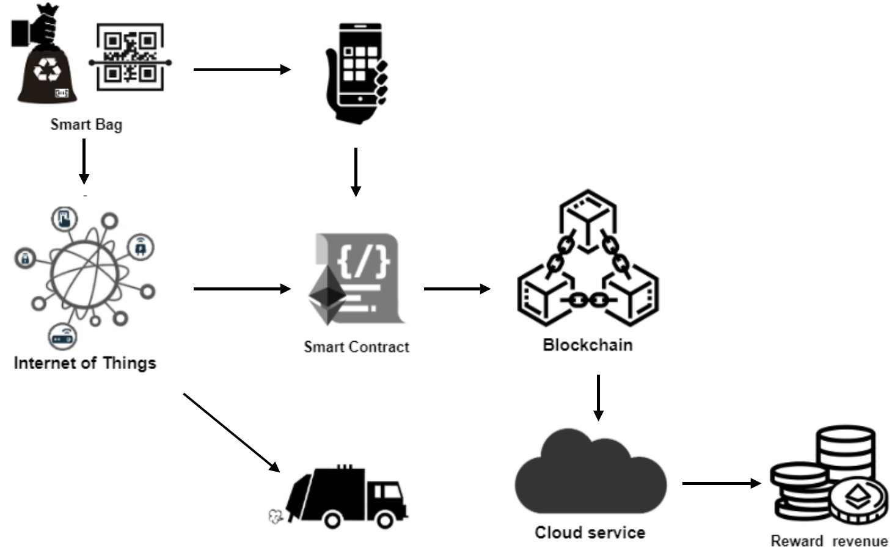
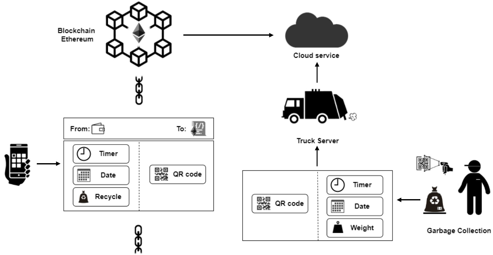

# Recycle-smart-contract
We propose to manage the data of the waste recycling
scenario using the Ethereum as our
blockchain platform.
The smart contract handle requests and store data needed to support the recycle process.

Such a solution assists door-to-door garbage collection by using practical and affordable QR-code and IoT sensors to accumulate and track all the fundamental data related to garbage, such as waste composition (paper, plastics, glass, etc.), bag weight, etc.

As recycling is properly handled by citizens, they can be rewarded with an adequate tax relief.

## Details

The data flow starts on the IoT side, when a QR-code has been scanned by waste collectors or
citizens then new data, such as a collected waste bag, a request to collect a bag, etc. are gathered. Such data are passed to a smart contract on the Ethereum blockchain platform, which provides an unalterable data storage repository.

The main data structure of the Recycle smart contract is the SmartBag struct representing the digital
version of the recycle bag. Its main parts are: a QR-code, the
delivery date and time of the bag, and the type of recycling.

In our proposed system, the QR code contains a string of
characters that allows the association between the user and
the bag once this has been conferred. The citizen attaches the
QR code to the waste bag once filled, following the municipal
calendar schedule. Then, the bag can be left outside the front
door, but only after the QR code has been scanned by the
conferring citizen.

The waste collector is equipped with an electronic code
scanner that will associate the QR code with the weight of the
single bag and the current day and time. The bag is weighed
by the waste truck by means of an additional footboard that
acts as a weight scale measuring the weight of the delivered
bag. In this way it is possible to store on a server in the
waste truck the data collected by the electronic reader and
the weighing scale.

The smart contract, in addition to providing Token to reward
users based on the amount of recycled material provided, to
use once the redeemable prize is reached.

To validate the effectiveness of the smart contract, tests were carried out using the tool Truffle.
